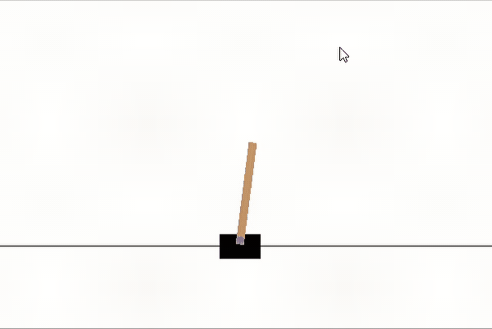

# The Zero Gradient Challenge: Neuroevolution using only Numpy!
#### By Jacob Gursky

Please see the Towards Data Science article on this topic here:
https://towardsdatascience.com/gradient-free-reinforcement-learning-neuroevolution-using-numpy-7377d6f6c3ea

### Introduction

What if I told you that you can train neural networks without ever calculating a gradient, and only using the forward pass?  Such is the magic of **neuroevolution!** Also, I am going to show that all this can easily be done using only Numpy!  This is a bit of an ongoing project that I have been working on off and on for a while now, but let's dive in!

### What is Neuroevolution?

First off, for those of you that don't already know, **neuroevolution** describes the application of evolutionary and/or genetic algorithms to training either the structure and/or weights of neural networks as a gradient-free alternative!  We are going to use an extremely simple case of neuroevolution here, only using a fixed topology network and focusing on optimizing only weights and biases.  The neuroevolutionary process can be defined by four fundamental steps that are repeated until convergence is reached, starting with a pool of randomly generated networks.

1. Evaluate fitness of the population
2. Select the most fit individual to reproduce
3. Repopulate using copies of the most fit network
4. Introduce normally distributed mutations to the network weights

Wow, this seems pretty simple!  Let's break down some of the terminology a bit:

- **Fitness**: This simply describes how well the network performed at a certain task and allows us to determine which networks to breed.  Note that because evolutionary algorithms are a form of non-convex optimization, and therefore can be used with any loss function, regardless of its differentiability (of lack thereof)

- **Mutation**:  This one is probably the easiest!  In order for our child networks to improve, we have to introduce random changes to the network weights, often drawn from a uniform or normal distibution. There can be many different forms of mutation: shift mutations (which multiply the paramters by a random number), swap mutations (which replace the parameter with a random number), sign mutations (which change the sign of a parameter), etc.  We are only going to be using simple additive mutations, but there is a lot of room for creativity here!

### Advantages of Neuroevolution

We should also consider the theoretical advantages of neuroevolutionary modeling.  First off, we only need to use the forward pass of the network as we only need to calculate the loss in order to determine which networks to breed.  The implications of this is obvious, the backwards pass is usually the most expensive!  Second, evolutionary algorithms are guarenteed to find the global minimum of a loss surface given enough iterations, whereas convex gradient-based methods can get stuck in local minima.  Lastly, more sophisticated forms of neuroevolution allow us to not only optimize the weights of a network, but also the structure itself!

### Why Not Always Use Neuroevolution Then?

Well, this is a complicated question but it really boils down to exact gradient descent methods being more effective when enough gradient information is available.  This means that the more convex a loss surface is, the more you will want to use analytic methods like SGD rather than genetic algorithms.  As a consequence, it is very rare that you will use genetic algorithms in a supervised context, as usually there is enough gradient infomation available that traditional gradient descent methods will work quite well.  However, if you are working in a RL context, or in a case with irregular loss surfaces or low convexity (like a sequential GAN), then neuroevolution provides a viable alternative!  In fact, much research has come out lately finding that parameter-for-parameter neuroevolutionary models usually do better in these settings.

Now let's jump in!

### Loading Libraries

As laid out in the introduction, we are going to try and use **only** numpy for this project, only defining the helper functions that we need! (Yes, I know, gym is also being loaded, but only for the environment ;) )


```python
# Loading libraries
import numpy as np
import gym
```

### About the Data
We are going to use the classic CartPole environment from gym to test our networks.  The goal is to see how long the network can keep the pole upright by shifting left and right.  As a RL task, neuroevolutionary methods should be a good fit!  Our network will take in 4 observations as input, and will output either left or right as an action.

## Helper Functions

We first are going to define a few of the helper functions to set up our networks.  First off is the relu activation function, which we will use as the activation function for our hidden layers, and the softmax function for the output of the network to get probabilistic estimates of the network output!  Lastly, we need to define a function that generates one-hot encodings of our response vector for when we need to calculate categorical cross-entropy.


```python
# Defining our activation function
def relu(x):
    return np.where(x>0,x,0)
```


```python
# Defining the softmax function
def softmax(x):
    x = np.exp(x - np.max(x))
    x[x==0] = 1e-15
    return np.array(x / x.sum())
```

### Defining Our Network Class

Now comes the fun stuff!  First we are going to define a class for our individual networks within the population.  We need to define an initialization method that randomly assigns weights and biases and takes the network structure as input, a prediction method so we can get probabilities given an input, and finally an evaluation method that returns the categorical cross-entropy of the network given an input and response!  Again, we are only going to use functions we define or functions from numpy.  Note that the initialization method can also take another network as an input, this is how we will perform mutations between generations!


```python
# Lets define a new neural network class that can interact with gym
class NeuralNet():
    
    # Initialization method
    def __init__(self, n_units=None, copy_network=None, var=0.02, episodes=50, max_episode_length=200):
        # Testing if we need to copy a network
        if copy_network is None:
            # Saving attributes
            self.n_units = n_units
            # Initializing empty lists to hold matrices
            weights = []
            biases = []
            # Populating the lists
            for i in range(len(n_units)-1):
                weights.append(np.random.normal(loc=0,scale=1,size=(n_units[i],n_units[i+1])))
                biases.append(np.zeros(n_units[i+1]))
            # Creating dictionary of parameters
            self.params = {'weights':weights,'biases':biases}
        else:
            # Copying over elements
            self.n_units = copy_network.n_units
            self.params = {'weights':np.copy(copy_network.params['weights']),
                          'biases':np.copy(copy_network.params['biases'])}
            # Mutating the weights
            self.params['weights'] = [x+np.random.normal(loc=0,scale=var,size=x.shape) for x in self.params['weights']]
            self.params['biases'] = [x+np.random.normal(loc=0,scale=var,size=x.shape) for x in self.params['biases']]
            
    # Defining our prediction method
    def act(self, X):
        # Grabbing weights and biases
        weights = self.params['weights']
        biases = self.params['biases']
        # First propgating inputs
        a = relu((X@weights[0])+biases[0])
        # Now propogating through every other layer
        for i in range(1,len(weights)):
            a = relu((a@weights[i])+biases[i])
        # Getting probabilities by using the softmax function
        probs = softmax(a)
        return np.argmax(probs)
        
    # Defining the evaluation method
    def evaluate(self, episodes, max_episode_length, render_env, record):
        # Creating empty list for rewards
        rewards = []
        # First we need to set up our gym environment
        env=gym.make('CartPole-v0')
        # Recording video if we need to 
        if record is True:
            env = gym.wrappers.Monitor(env, "recording")
        # Increasing max steps
        env._max_episode_steps=1e20
        for i_episode in range(episodes):
            observation = env.reset()
            for t in range(max_episode_length):
                if render_env is True:
                    env.render()
                observation, _, done, _ = env.step(self.act(np.array(observation)))
                if done:
                    rewards.append(t)
                    break
        # Closing our enviroment
        env.close()
        # Getting our final reward
        if len(rewards) == 0:
            return 0
        else:
            return np.array(rewards).mean()
```

### Defining Our Genetic Algorithm Class

Lastly we need to define a class that manages our population, performing the four key steps in neuroevolution!  We need three methods here.  First an initialization method that creates a pool of random networks and sets attributes.  Next, we need a fit method that, given an input, repeatedly performs the steps outlined above: first evaluating networks, then selecting the most fit, creating child networks, and finally mutating the children!  Lastly, we need a prediction method so that we can use the best network trained by the class.  Let's get down to testing!


```python
# Defining our class that handles populations of networks
class GeneticNetworks():
    
    # Defining our initialization method
    def __init__(self, architecture=(4,16,2),population_size=50, generations=500,render_env=True, record=False,
                 mutation_variance=0.02,verbose=False,print_every=1,episodes=10,max_episode_length=200):
        # Creating our list of networks
        self.networks = [NeuralNet(architecture) for _ in range(population_size)]
        self.population_size = population_size
        self.generations = generations
        self.mutation_variance = mutation_variance
        self.verbose = verbose
        self.print_every = print_every
        self.fitness = []
        self.episodes = episodes
        self.max_episode_length = max_episode_length
        self.render_env = render_env
        self.record = record
        
    # Defining our fiting method
    def fit(self):
        # Iterating over all generations
        for i in range(self.generations):
            # Doing our evaluations
            rewards = np.array([x.evaluate(self.episodes, self.max_episode_length, self.render_env, self.record) for x in self.networks])
            # Tracking best score per generation
            self.fitness.append(np.max(rewards))
            # Selecting the best network
            best_network = np.argmax(rewards)
            # Creating our child networks
            new_networks = [NeuralNet(copy_network=self.networks[best_network], var=self.mutation_variance, max_episode_length=self.max_episode_length) for _ in range(self.population_size-1)]
            # Setting our new networks
            self.networks = [self.networks[best_network]]+new_networks
            # Printing output if necessary
            if self.verbose is True and (i%self.print_every==0 or i==0):
                print('Generation:',i+1,'| Highest Reward:',rewards.max().round(1),'| Average Reward:',rewards.mean().round(1))
        
        # Returning the best network
        self.best_network = self.networks[best_network]
```

### Testing Our Algorithm!

As stated above, we are going to test our networks on the CartPole problem, using only 1 hidden layer with 16 nodes, and two output nodes denoting either a left or right movement.  We also need to average over many episodes, so we don't accidentally pick a bad network for the next generation!  I picked many of these parameters after a little trial-and-error, so your milage may vary!  Also, we will only introduce mutations with a variance of 0.05, so as to not break the functionality of the networks.


```python
# Lets train a population of networks
from time import time
start_time = time()
genetic_pop = GeneticNetworks(architecture=(4,16,2),
                                population_size=64, 
                                generations=5,
                                episodes=15, 
                                mutation_variance=0.1,
                                max_episode_length=10000,
                                render_env=False,
                                verbose=True)
genetic_pop.fit()
print('Finished in',round(time()-start_time,3),'seconds')
```

    Generation: 1 | Highest Reward: 309.5 | Average Reward: 29.2
    Generation: 2 | Highest Reward: 360.9 | Average Reward: 133.6
    Generation: 3 | Highest Reward: 648.2 | Average Reward: 148.0
    Generation: 4 | Highest Reward: 616.6 | Average Reward: 149.9
    Generation: 5 | Highest Reward: 2060.1 | Average Reward: 368.3
    Finished in 35.569 seconds
    

### Initial Random Network

First let's look at how a randomly initialized network performs on the task.  Obviously, there is no strategy here and the pole falls over almost immediately. Please ignore the curson on the gif below, recording in Gym doesn't play nice with Windows!




```python
#random_network = NeuralNet(n_units=(4,16,2))
#random_network.evaluate(episodes=1, max_episode_length=int(1e10), render_env=True, record=False)
```

### 5 Generations Later...

After only 5 generations, we can see that our network has almost completely mastered the art of the CartPole!  And it only took around thirty seconds of train-time!  Note that with further training, the network learns to keep it completely upright nearly 100% of the time, but for now we are just interested in speed, and 5 generations is rather short!  We should consider this a good example of the power of neuroevolution.


```python
# Lets observe our best network
#genetic_pop.best_network.evaluate(episodes=3, max_episode_length=int(1e10), render_env=True, record=False)
```

### Whats Next?

Obviously there are quite a few things we could add in the future to further examine the effectiveness of neuroevolution.  Firstly, it would interesting to study the effects of different mutation operators such as cross-over.  

It would also be a smart idea to shift over to a modern deep-learning platform like TensorFlow or PyTorch.  Note that genetic algorithms are highly parallelizable, as all we would have to do is run each network on a single device with one forward pass.  No need to mirror weights or complicated distribution strategies!  Therefore we have a nearly linear decrease in run-time with each addition unit of processing.

Lastly, we should explore neuroevolution on different reinforcement learning tasks, or even other situations where gradients can be difficult to evaluate, such as in Generative Adversarial Networks or long-sequence LSTM networks.

### Further Reading

If you are interested in neuroevolution and its applications, Uber has a fantastic page on several papers showing the modern advantages of neuroevolution in reinforcement learning:

https://eng.uber.com/tag/deep-neuroevolution/

If you have any questions about this project or just want to discuss deep learning, feel free to email me at gurskyjacob@gmail.com!
